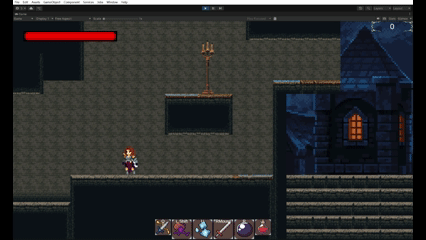
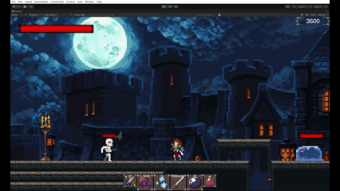

# Metroidvania
# 2D RPG 类银河恶魔城游戏（Unity）

## 项目简介

本项目是一款基于 **Unity 2022.3** 开发的 2D 类银河恶魔城（Metroidvania）风格 RPG 游戏。项目以角色控制与战斗体验为核心，完整实现了角色移动、战斗、技能、动画系统、UI 交互以及摄像机控制等核心玩法模块。

该项目为个人完成的实践项目，开发过程中重点关注 **玩法系统拆分、状态管理、动画与逻辑同步以及 Bug 定位与修复**，用于 Unity 客户端开发方向的学习与实践。

---

## 技术栈

* **游戏引擎**：Unity 2022.3
* **开发语言**：C#
* **核心模块**：

  * Unity 2D
  * Animator / BlendTree
  * Cinemachine
  * UGUI
* **版本管理**：Git

---

## 核心功能

### 角色系统

* 基于状态机的角色行为设计
* 支持 Idle、Move、Jump / Fall、Dash、WallSlide、Attack、CounterAttack、Die 等多种状态
* 状态之间通过统一接口切换，逻辑结构清晰，便于扩展

### 战斗与技能系统

* 实现近战与远程两种攻击方式
* 技能释放流程通过协程进行控制
* 支持技能冷却时间（CD）管理

### 动画系统

* 使用 Animator 状态机进行动画管理
* 通过参数驱动动画状态切换，保证动画与逻辑状态一致
* 部分动画使用 BlendTree 实现平滑过渡（如上升 / 下落状态）

### 物理与交互

* 基于 Rigidbody2D 与 Collider2D 处理角色、敌人和场景之间的物理交互
* 支持触发器与碰撞检测逻辑

### UI 系统

* 使用 UGUI 构建游戏界面
* UI 与角色行为通过事件机制进行交互
* 处理 UI 面板开启时的输入冲突问题，避免误触角色行为

### 摄像机系统

* 使用 Cinemachine 实现摄像机跟随
* 支持镜头震动与移动范围限制，提升游戏表现力

---

## 开发过程中的问题与解决

* **UI 面板开启时误触角色攻击**
  在 UI 打开时统一控制游戏状态，暂停游戏逻辑，关闭 UI 时恢复，避免输入穿透问题。

* **动画与逻辑状态同步问题**
  通过 Animator 参数驱动动画切换，并与角色状态机保持一致，减少动画切换异常。

---

## 项目结构说明（简要）

* `Player`：角色主体控制
* `Enemy`：敌人行为
* `State`：状态基类及各具体状态实现
* `Stats`：属性管理
* `Skill`：技能相关逻辑脚本
* `UI`：界面与交互逻辑
* `ItemData`：物品数据
* `Inventory`：背包

---

## 项目说明

* 本项目为个人学习与实践用途
* 代码中保留了较为完整的提交记录，方便查看开发过程
* 可直接运行，无需额外配置

---

## 项目演示

### 角色移动

### 战斗

### UI 界面

### 完整演示视频
[点击观看演示视频](https://www.bilibili.com/video/BV1iZmyBMECX)
